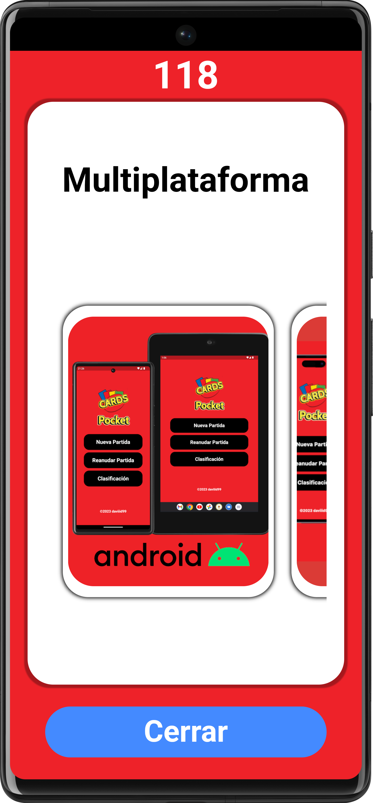

# CARDS Pocket Event
Presentación del proyecto CARDS Pocket

# Descargas
Visualiza esta presentación

<a href="https://play.google.com/store/apps/details?id=com.daviiid99.cards_pocket_event"></a></br>
<a href="https://daviiid99.github.io/Cards_Pocket_Event/webApp"></a></br>

# Compatibilidad
- [x] android
- [x] web

# Dependencias
Las dependencias de software libre que hacen que este proyecto sea posible
```
  stacked: ^3.2.0
  audioplayers: ^3.0.1
  flutter_launcher_icons: ^0.12.0
  sqflite: ^2.2.6
  quiver: ^3.2.1
  path_provider: ^2.0.14
  sqflite_common_ffi_web: ^0.3.3+3
```

# Capturas de pantalla
Capturas de las principales pantallas de la aplicación


<br/>

<br/>

<br/>

<br/>

<br/>

<br/>
